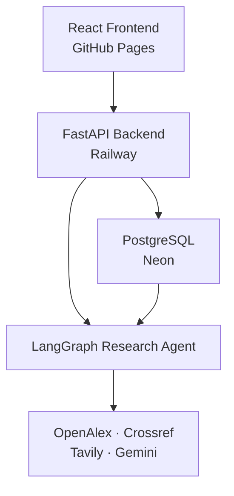

# EvidenceGraph

EvidenceGraph is a multilingual agentic research platform that searches scientific literature and web sources, ranks evidence semantically, generates sourced answers, and visualizes the relationship between questions, claims, papers, and web sources.

The system supports research conversations with persistent memory. Follow-up questions are answered from the saved research context when sufficient evidence already exists; otherwise, the agent performs a new search and merges the results into the conversation.

## Live Application

- **Frontend:** https://naghamamer.github.io/EvidenceGraph/
- **Backend API:** https://evidencegraph-production.up.railway.app
- **API Health:** https://evidencegraph-production.up.railway.app/api/v1/health
- **API Documentation:** https://evidencegraph-production.up.railway.app/docs

> The frontend is deployed on GitHub Pages. The backend is deployed on Railway and may be subject to Railway trial usage limits.

## Main Features

- Multilingual scientific questions.
- Automatic RTL and LTR text direction.
- Answers generated in the language of the question.
- Scientific search through OpenAlex and Crossref.
- General web search through Tavily.
- Semantic ranking using multilingual embeddings.
- Evidence claims connected to their original sources.
- Supports, contradicts, mixed, and uncertain evidence states.
- Interactive evidence graph visualization.
- Expandable paper abstracts and web-source content.
- Direct links to original scientific and web sources.
- Follow-up research conversations.
- Reuses existing research memory when it contains enough evidence.
- Performs additional searches when saved context is insufficient.
- Persistent research sessions stored in PostgreSQL.
- Browser-specific history without requiring account registration.
- Conversation history, loading, pagination, and deletion.
- Configurable result limit applied to both papers and web sources.
- Responsive desktop and mobile interface.
- Friendly validation, gateway, timeout, and service error handling.
- Dockerized development and production environments.
- Automated frontend deployment with GitHub Actions.

## System Architecture



## Research Workflow

1. The user submits a question in any supported language.
2. The question analyzer detects its language and prepares an English scientific query.
3. The scientific search service retrieves papers from OpenAlex and Crossref.
4. Tavily retrieves complementary web sources.
5. FastEmbed generates multilingual embeddings.
6. Results are ranked using semantic similarity.
7. Gemini generates an answer linked to evidence identifiers.
8. The API stores the research session, answer, evidence, papers, and web sources.
9. The frontend displays the answer, sources, limitations, and evidence graph.
10. For follow-up questions, the agent decides whether saved memory is sufficient or a new search is required.

## Research Memory

EvidenceGraph does not require user registration.

The frontend creates a random client identifier and stores it in the browser's local storage. The identifier is sent to the backend through the `X-Client-ID` header.

This provides:

- Separate research history for each browser.
- Persistent conversations on the same browser and device.
- No email, password, or authentication form.
- Protection against displaying another browser's sessions.
- Saved questions, answers, evidence, papers, and web sources.

Because the identifier is stored locally, clearing browser storage or using another browser creates a new independent research history.

## Technology Stack

### Backend

- Python 3.12
- FastAPI
- LangGraph
- LangChain
- Google Gemini
- Tavily
- FastEmbed
- NumPy
- HTTPX
- Pydantic
- SQLAlchemy 2
- Psycopg 3
- Alembic
- PostgreSQL
- Pytest

### Frontend

- React 19
- Vite 8
- Material UI
- Framer Motion
- Vitest
- React Testing Library
- jsdom

### Scientific and Web Providers

- OpenAlex
- Crossref
- Tavily
- Google Gemini

### Infrastructure and Deployment

- Docker
- Docker Compose
- Nginx
- Neon PostgreSQL
- Railway
- GitHub Pages
- GitHub Actions

## API Endpoints

| Method | Endpoint | Purpose |
|---|---|---|
| `GET` | `/` | API welcome and service information |
| `GET` | `/api/v1/health` | Service health check |
| `GET` | `/api/v1/papers/search` | Search scientific papers |
| `GET` | `/api/v1/papers/semantic-search` | Semantically rank scientific papers |
| `POST` | `/api/v1/research` | Start and save a new research session |
| `GET` | `/api/v1/research/history` | Load the current browser's research history |
| `GET` | `/api/v1/research/{research_id}` | Load a saved research session |
| `POST` | `/api/v1/research/{research_id}/follow-up` | Submit a follow-up question |
| `DELETE` | `/api/v1/research/{research_id}` | Delete a saved research session |
| `GET` | `/docs` | Swagger API documentation |
| `GET` | `/redoc` | ReDoc API documentation |

## Project Structure

```text
EvidenceGraph/
├── .github/
│   └── workflows/
│       └── deploy-frontend.yml
├── backend/
│   ├── alembic/
│   │   └── versions/
│   ├── app/
│   │   ├── agents/
│   │   ├── api/
│   │   ├── core/
│   │   ├── db/
│   │   ├── models/
│   │   ├── nlp/
│   │   ├── schemas/
│   │   └── services/
│   ├── tests/
│   ├── Dockerfile
│   ├── alembic.ini
│   ├── requirements.txt
│   └── requirements-dev.txt
├── frontend/
│   ├── public/
│   ├── src/
│   │   ├── components/
│   │   ├── services/
│   │   ├── test/
│   │   └── utils/
│   ├── Dockerfile
│   ├── nginx.conf
│   ├── package.json
│   ├── vite.config.js
│   └── vitest.config.js
├── data/
├── deploy/
├── docs/
│   └── weeks/
├── scripts/
├── .env.example
├── compose.yaml
├── compose.production.yaml
└── README.md
```

## Environment Configuration

Create a local environment file:

```powershell
Copy-Item .env.example .env
```

Configure the required private values inside `.env`:

```text
LLM_API_KEY
TAVILY_API_KEY
DATABASE_URL
SECRET_KEY
```

Optional provider and application settings are documented in `.env.example`.

Never commit `.env` or expose API keys in source code, screenshots, deployment logs, or documentation.

## Run with Docker

Build and start the development environment:

```powershell
docker compose up -d --build
```

Check the containers:

```powershell
docker compose ps
```

Open:

```text
Frontend: http://localhost:5173
Backend:  http://localhost:8000
Health:   http://localhost:8000/api/v1/health
Docs:     http://localhost:8000/docs
```

Stop the environment:

```powershell
docker compose down
```

## Production Docker Environment

Build and start the local production configuration:

```powershell
docker compose -f compose.production.yaml up -d --build
```

Check service health:

```powershell
docker compose -f compose.production.yaml ps
```

Stop the production environment:

```powershell
docker compose -f compose.production.yaml down
```

The production frontend is built with Vite and served by Nginx. The production backend applies Alembic migrations before starting Uvicorn.

## Backend Tests

Run the backend test suite through Docker:

```powershell
docker compose -f compose.yaml run --rm --no-deps api python -m pytest -q
```

Latest verified result:

```text
60 passed
```

## Frontend Validation

```powershell
Set-Location frontend
npm ci
npm test
npm run lint
npm run build
Set-Location ..
```

Latest verified results:

```text
19 tests passed
0 lint warnings
0 lint errors
Production build completed successfully
```

## Cloud Deployment

### Frontend

The React application is built and deployed automatically to GitHub Pages through:

```text
.github/workflows/deploy-frontend.yml
```

The workflow:

1. Installs frontend dependencies.
2. Runs tests.
3. Runs lint validation.
4. Builds the Vite application using `/EvidenceGraph/` as its production base path.
5. Uploads the generated `dist` directory.
6. Deploys the frontend to GitHub Pages.

### Backend

The production backend Docker image is deployed on Railway.

Railway:

- Builds the production stage from `backend/Dockerfile`.
- Applies Alembic database migrations.
- Starts the FastAPI application with Uvicorn.
- Uses the public health endpoint to monitor the service.
- Connects securely to the Neon PostgreSQL database.

### Database

The cloud database is hosted on Neon PostgreSQL.

Research sessions and turns are persisted in:

- `research_sessions`
- `research_turns`

Database schema changes are managed through Alembic migrations.

## Development Milestones

### Week 1 — Foundation

- Repository architecture
- FastAPI foundation
- Environment configuration
- Docker setup
- Health endpoint

### Week 2 — Scientific Search

- OpenAlex integration
- Crossref integration
- Unified scientific paper schemas
- Provider normalization

### Week 3 — NLP and Semantic Ranking

- Multilingual embeddings
- Semantic similarity
- Scientific result ranking
- Evidence-aware answer generation

### Week 4 — Agentic Research

- LangGraph research workflow
- Question analysis
- Scientific and web search orchestration
- Multilingual answer generation

### Week 5 — Interactive Frontend

- React and Material UI interface
- Responsive desktop and mobile layout
- Research progress and results
- Papers, web sources, evidence, and limitations

### Week 6 — Memory, Graph, and Deployment

- PostgreSQL persistence
- Browser-specific research history
- Follow-up conversations
- Conditional memory reuse
- Evidence graph visualization
- Production Docker configuration
- Neon, Railway, and GitHub Pages deployment
- GitHub Actions automation

## Deployment Status

EvidenceGraph is complete and publicly deployed.

The complete system has been tested through:

- Backend automated tests.
- Frontend component and service tests.
- Lint validation.
- Production frontend builds.
- Docker development and production environments.
- Desktop browser testing.
- Mobile browser testing.
- Live frontend-to-backend communication.
- Persistent Neon database storage.

## License

This project is provided for educational and portfolio purposes.
