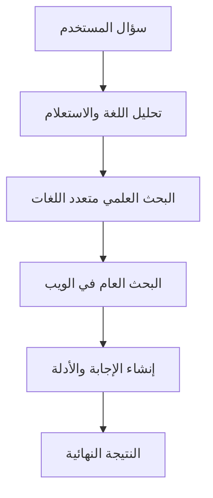

# الأسبوع الرابع — الوكيل البحثي متعدد اللغات

## هدف الأسبوع

تحويل EvidenceGraph من خدمة بحث دلالي إلى وكيل بحثي قادر على فهم سؤال المستخدم بأي لغة، والبحث في المصادر العلمية والويب، ثم إنشاء إجابة مبنية على الأدلة بلغة المستخدم.

## ما تم إنجازه

### 1. إعداد نموذج اللغة

تم ربط المشروع مع Gemini باستخدام:

```text
langchain-google-genai
```

النموذج المستخدم:

```text
gemini-3.5-flash-lite
```

يُستخدم النموذج في:

- اكتشاف لغة السؤال.
- تحويل السؤال إلى استعلام بحث إنجليزي.
- تحسين صياغة الاستعلام.
- إنشاء الإجابة النهائية.
- استخراج الأدلة والقيود في صيغة منظمة.

مفتاح Gemini موجود داخل `.env` فقط ولا يُرفع إلى GitHub.

### 2. تحليل السؤال متعدد اللغات

تم إنشاء:

```text
backend/app/agents/question_analyzer.py
```

يقوم `QuestionAnalyzer` بالمهام التالية:

1. تنظيف سؤال المستخدم.
2. اكتشاف اللغة واسمها ورمزها.
3. ترجمة السؤال إلى الإنجليزية.
4. تحسينه ليصبح مناسبًا للبحث العلمي والعام.
5. الحفاظ على المصطلحات العلمية والأرقام والتواريخ.
6. إعادة النتيجة في بنية `QuestionAnalysis`.

مثال:

```text
السؤال:
هل تقلل ممارسة الرياضة الاكتئاب لدى البالغين؟

اللغة:
Arabic — ar

استعلام البحث:
effects of regular physical exercise on depression in adults
```

### 3. إضافة البحث العام في الويب

تم إنشاء:

```text
backend/app/services/web_search.py
```

يستخدم المشروع أداة Tavily الجاهزة للبحث في الويب العام.

تقوم الخدمة بـ:

- إرسال استعلام البحث الإنجليزي.
- استقبال النتائج.
- تجاهل النتائج غير الصالحة.
- توحيد العنوان والرابط والمحتوى ودرجة الصلة.
- إرجاع النتائج بصيغة `WebSearchResponse`.
- تحويل أخطاء Tavily إلى خطأ واضح داخل المشروع.

المصادر العامة لا تُعامل على أنها أوراق علمية.

### 4. البحث العلمي متعدد اللغات

تم إنشاء:

```text
backend/app/services/multilingual_scientific_search.py
```

تبحث الخدمة باستخدام:

- السؤال بلغته الأصلية.
- الاستعلام الإنجليزي المحسن.

يتم البحث عبر:

```text
OpenAlex
Crossref
```

بعد ذلك يقوم النظام بـ:

1. جمع نتائج الاستعلامين.
2. الاستمرار إذا فشل أحدهما.
3. دمج المصادر الناجحة.
4. حذف الأوراق المتكررة.
5. إعادة ترتيب الأوراق دلاليًا.
6. إرجاع أفضل عدد طلبه المستخدم.

إذا كان السؤال مكتوبًا بالإنجليزية أصلًا، لا يتكرر استعلام البحث نفسه.

### 5. حذف تكرار الأوراق العلمية

تم توفير واجهة عامة داخل:

```text
PaperSearchService.deduplicate_papers()
```

يتم اكتشاف التكرار بالترتيب التالي:

1. استخدام DOI إن كان موجودًا.
2. استخدام العنوان الموحد مع سنة النشر عند غياب DOI.
3. دمج بيانات النسختين بدل حذف المعلومات المفيدة.

قد تحتوي الورقة المدمجة على:

```json
{
  "providers": [
    "openalex",
    "crossref"
  ]
}
```

### 6. إنشاء مولد الإجابات

تم إنشاء:

```text
backend/app/agents/answer_generator.py
```

يقوم `AnswerGenerator` بتحويل النتائج إلى سياق منظم.

معرفات الأوراق العلمية:

```text
[P1]
[P2]
[P3]
```

معرفات مصادر الويب:

```text
[W1]
[W2]
[W3]
```

قواعد توليد الإجابة:

- الإجابة بلغة سؤال المستخدم.
- تفضيل الأوراق العلمية على مصادر الويب.
- عدم اختراع حقائق أو مصادر.
- توضيح التعارض بين المصادر.
- ذكر نقص الأدلة عندما تكون غير كافية.
- إبقاء DOI والروابط والأسماء العلمية كما هي.
- حذف أي معرف مصدر غير موجود فعليًا.

تبقى عناوين ومقتطفات المصادر بلغتها الأصلية للمحافظة على دقتها، بينما تكون الإجابة النهائية بلغة المستخدم.

### 7. تنظيم الوكيل باستخدام LangGraph

تم إنشاء:

```text
backend/app/agents/research_graph.py
```

يستخدم الوكيل LangGraph لتنظيم المراحل.



عقد الـGraph هي:

```text
analyze_question
search_scientific
search_web
generate_answer
```

الحالة المشتركة بين العقد موجودة في:

```text
backend/app/agents/state.py
```

وتحمل:

- السؤال الأصلي.
- عدد النتائج المطلوب.
- اللغة المكتشفة.
- الاستعلام الإنجليزي.
- النتائج العلمية.
- نتائج الويب.
- الإجابة والأدلة.
- الأخطاء الجزئية.

### 8. التعامل مع الفشل الجزئي

لا يتوقف الوكيل مباشرة عند تعطل مصدر واحد.

أمثلة:

- إذا فشل OpenAlex واستجاب Crossref، يستمر البحث.
- إذا فشل البحث بالسؤال الأصلي ونجح الاستعلام الإنجليزي، يستمر.
- إذا فشل Tavily، تُحفظ رسالة الخطأ ويمكن متابعة النتائج العلمية.
- تُعاد الأخطاء الجزئية ضمن حقل:

```json
{
  "errors": []
}
```

أما الخطأ غير المتوقع في الوكيل، فيُعاد كاستجابة:

```text
502 Bad Gateway
```

### 9. إنشاء Research Agent API

تم إنشاء المسار:

```text
POST /api/v1/research
```

مثال للطلب:

```json
{
  "question": "هل تقلل ممارسة الرياضة الاكتئاب لدى البالغين؟",
  "limit": 5
}
```

أهم أجزاء الاستجابة:

```json
{
  "question": "السؤال الأصلي",
  "detected_language": "Arabic",
  "language_code": "ar",
  "english_query": "optimized English query",
  "answer": "الإجابة بلغة المستخدم",
  "evidence": [],
  "limitations": [],
  "scientific_total": 0,
  "scientific_providers": [],
  "papers": [],
  "web_total": 0,
  "web_sources": [],
  "errors": []
}
```

يمكن تجربة المسار من Swagger:

```text
http://localhost:8000/docs
```

### 10. تحسين استقرار Docker

بسبب استخدام Docker Desktop مع Hyper-V ووجود المشروع على القرص `D:`، أدى ربط مجلدات Windows مباشرة بالحاوية إلى تعليق عمليات استيراد Python أحيانًا.

تمت إزالة روابط:

```text
./backend/app:/app/app
./backend/tests:/app/tests
```

مع الإبقاء على Volume نموذج الـEmbeddings:

```text
embedding_models:/models
```

لذلك بعد تعديل كود Python يجب تنفيذ:

```powershell
docker compose build api
docker compose up -d --force-recreate api
```

يبقى نموذج الـEmbedding محفوظًا داخل Docker Volume ولا يُعاد تنزيله عند إعادة بناء الصورة.

### 11. الاختبارات الآلية

تمت إضافة اختبارات للأجزاء التالية:

- تحليل السؤال متعدد اللغات.
- رفض السؤال أو الاستعلام الفارغ.
- معالجة نتائج Tavily.
- التعامل مع فشل البحث الخارجي.
- بناء سياق الأوراق ومصادر الويب.
- التحقق من معرفات المصادر.
- البحث بالسؤال الأصلي والإنجليزي.
- منع تكرار الاستعلام الإنجليزي.
- تشغيل عقد LangGraph كاملة.
- نجاح Research Agent API.
- التحقق من المدخلات.
- معالجة أخطاء الوكيل.

تشغيل الاختبارات:

```powershell
docker compose exec -T api python -m pytest -q
```

## تقنيات الأسبوع الرابع

```text
Python
FastAPI
Pydantic
LangChain Core
LangGraph
Google Gemini
Tavily Search
OpenAlex
Crossref
FastEmbed
NumPy
Docker
Pytest
```

## النتيجة الحالية

يستطيع EvidenceGraph الآن:

1. استقبال سؤال بحثي بأي لغة.
2. اكتشاف لغة السؤال.
3. إنشاء استعلام إنجليزي محسن.
4. البحث في OpenAlex وCrossref.
5. البحث في الويب باستخدام Tavily.
6. دمج النتائج العلمية وإزالة التكرار.
7. ترتيب الأوراق باستخدام التشابه الدلالي.
8. إنشاء إجابة بلغة المستخدم.
9. ربط الادعاءات بمعرفات المصادر.
10. إظهار القيود والأخطاء الجزئية.

## ما سيأتي لاحقًا

- تخزين عمليات البحث والنتائج في قاعدة بيانات.
- بناء الرسم البياني الفعلي للادعاءات والأدلة.
- إنشاء واجهة Frontend.
- تجهيز النشر السحابي.
